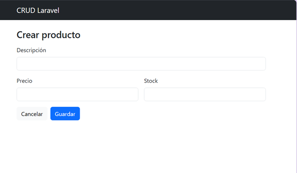
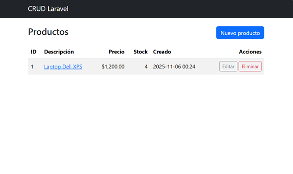

# Laboratorio del CRUD en Laravel

## 🧩 Descripción
Este laboratorio demuestra la implementación completa de un **CRUD (Create, Read, Update, Delete)** en Laravel 10.  
El proyecto permite gestionar productos con campos **descripción**, **precio** y **stock**, utilizando **Bootstrap 5** para la interfaz y **MySQL** como base de datos.

---

## ⚙️ Tecnologías utilizadas
- **Laravel 10**
- **PHP 8.1+**
- **MySQL / MariaDB**
- **Bootstrap 5 (CDN)**
- **Composer**

---

## 🚀 Instrucciones de instalación

1. Clona el repositorio:
   ```bash
   git clone https://github.com/britval/Laboratorio_del_Crud.git
   cd Laboratorio_del_Crud
   ```

2. Instala dependencias:
   ```bash
   composer install
   ```

3. Crea tu archivo `.env` y configura la conexión a base de datos:
   ```
   DB_CONNECTION=mysql
   DB_HOST=127.0.0.1
   DB_PORT=3306
   DB_DATABASE=crud_rapido
   DB_USERNAME=root
   DB_PASSWORD=
   ```

4. Genera la clave y ejecuta migraciones:
   ```bash
   php artisan key:generate
   php artisan migrate
   ```

5. Levanta el servidor:
   ```bash
   php artisan serve
   ```
   Luego abre [http://127.0.0.1:8000/products](http://127.0.0.1:8000/products)

---

## 🧱 Estructura principal del proyecto

```
app/
 ├── Http/Controllers/ProductController.php
 ├── Models/Product.php
database/
 └── migrations/2025_11_05_create_products_table.php
resources/
 ├── views/layouts/app.blade.php
 └── views/products/
     ├── index.blade.php
     ├── create.blade.php
     ├── edit.blade.php
     └── show.blade.php
routes/
 └── web.php
```

---

## 🧮 Funcionalidades implementadas

- **Listar productos** con paginación  
- **Crear** nuevos productos con validación de campos  
- **Editar** y **actualizar** registros existentes  
- **Eliminar** productos con confirmación  
- **Mensajes flash** de éxito en cada acción  

---

## 🖼️ Evidencias del funcionamiento

### Formulario de creación


### Listado de productos


---

## 🧠 Aprendizajes clave

- Uso de controladores tipo *Resource Controller* (`php artisan make:controller --resource`)
- Definición de rutas RESTful mediante `Route::resource()`
- Validación de datos con `Request->validate()`
- Implementación de *flash messages* en vistas Blade
- Buenas prácticas en asignación masiva (`$fillable`)

---

## 👩‍💻 Autora
**Britney Valoy Becker**  
Estudiante de Ingeniería en Sistemas Computacionales — UTP  
GitHub: [@britval](https://github.com/britval)

---

## 🏁 Resultado Final
La aplicación se ejecuta correctamente mostrando la interfaz de gestión de productos:

- ✅ Inserción exitosa  
- ✅ Listado paginado  
- ✅ Edición y eliminación funcional  
- ✅ Conexión estable a MySQL  
- ✅ Interfaz limpia y responsiva con Bootstrap
